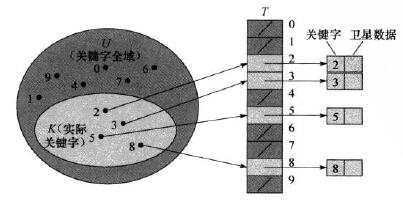

# 11.1 Direct-address tables

标签：  直接寻址表

---

###笔记
散列表使用一个长度与实际存储的关键字数目成比例的数组来存储。在散列表中不是直接把关键字作为下标，而是根据关键字**计算**出相应的下标。  
**冲突**：多个关键字映射到同一个下标。

**直接寻址表**：适用于关键字的全域U比较小的时候，并且假设集合中**无关键字相同**的元素。



> 若集合中没有关键字为k的元素，则T[k]=NIL

```c++
//每个操作都是O(1)的时间
DirectAddressSearch(T,k)
    return T[k.key]
DirectAddressInsert(T,x)
    T[x.key] = x
DirectAddressDelete(T,x)
    T[x.key] = NIL
```
---
###练习
11.1-1：O(n)  

---
[1]: https://github.com/wj1066/pictures/blob/master/CLRS/11.1-1.jpg