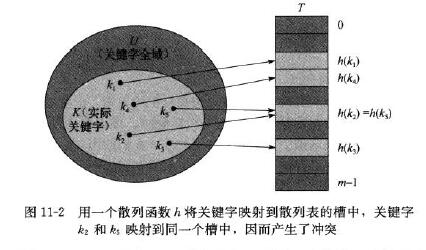

# 11.2 Hash tables

标签（空格分隔）： 散列表

---
###笔记
上一节的直接寻址法缺点很大，一是如果全域U很大，则很难存储，二如果实际存储的K对U来说很小，则浪费了很多的空间。

在直接寻址法中，关键为k的元素放在槽k中。但是在散列方式下，它被放在槽h(k)中，h为散列函数。

> 散列函数h将关键字的全域U映射到散列表T[0..m-1]的槽位上。它缩小了数组下标的范围，即减少了数组的大小，由|U|减少为m。



两个关键字映射到同一个槽中，称为**冲突**。本章介绍两种冲突解决方法，**链接法**和**开放寻址法**。

####链接法
链接法（拉链法），把散列到同一个槽中的所有元素都放在一个链表中。
```c++
//拉链法解决冲突的散列表的字典操作
ChainedHashInsert(T,x)
    insert x at the end of list T[h(x.key)]
ChainedHashSearch(T,k)
    search for an element with key k in list T[h(k)]
ChainedHashDelete(T,x)
    delete x from the list T[h(x.key)]
```

> 此方法下表字典操作的效率和链表的实现形式有关，若为双向链表，插入和删除的操作是O(1)，查找最坏是O(n)。

散列表性能分析：  
定理11.1，在简单均匀散列的假设下，对于用链接法解决冲突的散列表，一次不成功查找的平均时间为θ(1+α)，α为装填因子（能存放n个元素，m个槽位的散列表T，α=n/m）。  
定理11.2，在简单均匀散列的假设下，对于用链接法解决冲突的散列表，一次成功查找的平均时间为θ(1+α)。

---
###练习
11.2-2：本上。  

---
[1]: https://github.com/wj1066/pictures/blob/master/CLRS/11.2-1.jpg