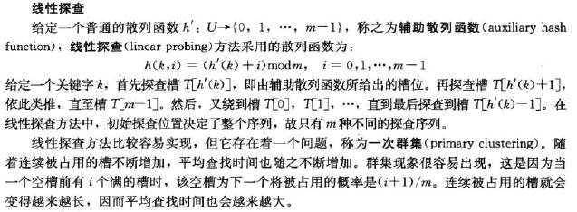
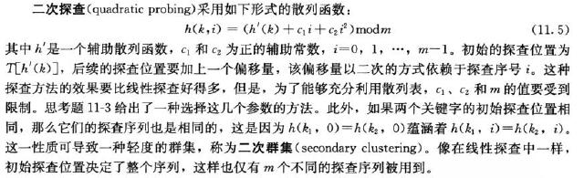
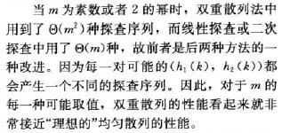

# 11.4 Open addressing

标签： 开放寻址法

---

###笔记
在开放寻址法中，所有元素都存放在散列表中，每个表项要么包含动态集合的一个元素，要么为NIL。所以**不同于链接法，散列表可能会被填满**，以至于不能插入新元素，所以在该方法中，装填因子α绝对**不可能超过1**。

```c++
//散列表插入（开放寻址法）
HashInsert(T,k)
    i = 0
    repeat
        j = h(k,i)
        if T[j] == NIL or T[j] == DELETED
            T[j] = k
            return j
        else
            i = i+1
    until i == m
    error "Hashtable overflow"
```

```c++
//散列表查找（开放寻址法）
HashSearch(T,k)
    i = 0
    repeat
        j = h(k,i)
        if T[j] == k
            return j
        else
            i = i+1
    until T[j] == NIL or i == m
```
在开放寻址法解决冲突的散列表中，删除元素不能简单将其置空，否则会影响其他关键字的检索，通常用一个特定的值DELETED来替换NIL。所以在必须删除关键字的应用中，更常见的做法是采用链接法解决冲突。

有三种常用的方法来计算开放寻址法的**探查序列**：线性探查，二次探查和双重探查。但是这些技术都不能满足均匀散列的假设，因为他们产生的不同探查序列都不超过m<sup>2</sup>个（均匀散列要求有m!个探查序列）。

####线性探查
散列函数：`h(k,i) = (h'(k)=1) mod m, i = 0,1,2,..,m-1`，这种方法初始位置决定了探查序列，只有**m**中不同的探查序列。



####二次探查
散列函数：`h(k,i) = (h'(k) + c1*i + c2*i^2) mod m`，该偏移量以来于探查序号i。但是为了充分利用散列表，c1,c2,m的值要收到限制。此外，如果两个关键字的初始探查位置相同，那么他们探查序列也相同，有可能导致**二次集群**。初始探查位置决定了整个序列，同样m中不同的探查序列。



####双重散列
双重散列是开放寻址法最好的方法之一，具有随机选择排列的许多特性。散列函数：`h(k,i) = (h1(k) + ih2(k)) mod m`，不像上两种方式，探查序列以两种不同的方式以来于关键字k。  
为了要查找整个散列表，值h2(k)必须与表的大小m互素。一种是取m为2的幂，并设计h2总产生奇数。另一种方法是去m为素数，并设计h2返回较m小的正整数（h2(k) = 1 + (k mod (m-1) )）[加1是让0-m-2变到1-m-1]。



####开放寻址散列的性能分析
定理11.6：给定一个转载因子为α<1的开放寻址散列表，假设是均匀散列，则对于一次不成功的查找，期望的探查次数最多是1/(1-α)。  
定理11.7：假设采用的是均匀散列，平均情况下，向一个装载因子为α的开放寻址散列表中插入一个元素，至多需要做1/(1-α)次探查。  
定理11.8：对于一个装载因子为α<1的开放寻址散列表，一次成功查找中的探查期望至多为(1/α)ln(1/(1-α))。（假设采用均匀散列，每个关键字被查找可能性相同）

---
###练习（无答案）
11-4-1：本上。  
11-4-2：删除见下，插入见上。
```c++
//开放寻址法 删除
HashDelete(T,k)
    i = 0
    repeat
        j = h(k,i)
        if T[j] == k
            T[j] = DELETE
            return
        else
            i = i+1
    until i == m
```

---


[1]: https://github.com/wj1066/pictures/blob/master/CLRS/11.4-1.jpg
[2]: https://github.com/wj1066/pictures/blob/master/CLRS/11.4-2.jpg
[3]: https://github.com/wj1066/pictures/blob/master/CLRS/11.4-3.jpg