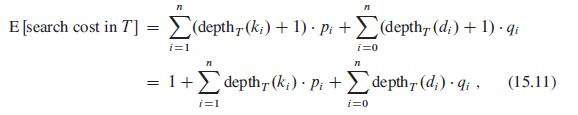
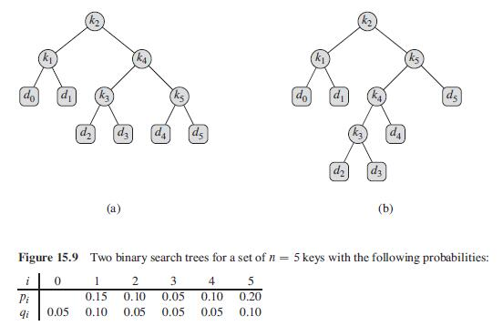
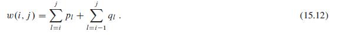
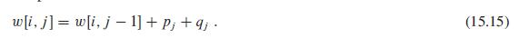
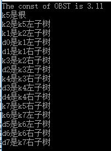

# 15.5 Optimal binary search trees

标签： 最优二叉搜索树

---
###笔记
最优二叉搜索树问题：给定一个n个不同的关键字的已经排好序的序列K，我们希望用这些关键字构成一棵二叉搜索树。对每个关键字k<sub>i</sub>都有一个p<sub>i</sub>表示搜索频率。有些搜索的值不在树中，我们还有n+1个伪关键字（树的叶结点），对每个伪关键字d<sub>i</sub>，也有个q<sub>i</sub>表示搜索频率。



二叉搜索树搜索期望代价如图所示（算导中的深度比严书中深度-1），搜索期望代价最小的二叉搜索树，称为**最优二叉树**。



如上，根据相同元素的两棵不同二叉树，a的代价是2.80，b的代价是2.75是最优的。可以看出**最优二叉搜索树不一定是最矮的。而且，概率最高的关键字也不一定出现在二叉搜索树的根结点**。

穷举法肯定不行，n个结点的二叉树的数量是Ω(4<sub>n</sub>/n<sub>3/2</sub>)，所以用动态规划。

**步骤1：最优二叉搜索树的结构**  
最优子结构：如果一棵最优二叉搜索树T有一棵包含关键字k<sub>i</sub>,..,k<sub>j</sub>的子树T'，那么T'必然是包含关键字k<sub>i</sub>,..,k<sub>j</sub>和伪关键字d<sub>i-1</sub>,..,d<sub>j</sub>的子问题的最优解，可以用剪贴黏贴法来证明。只要我们检查所有可能的根结点k<sub>r</sub>(i<=r<=j)，并对每种情况分别求解包含k<sub>i</sub>,..,k<sub>r-1</sub>以及包含k<sub>r+1</sub>,..,k<sub>j</sub>的最优二叉搜索树，就可以保证找到原问题的解。
对于k<sub>i</sub>,..,k<sub>j</sub>我们选k<sub>i</sub>最为根结点，则左子树为k<sub>i</sub>,..,k<sub>i-1</sub>，此时左子树为空子树，不包含任何关键字但包含单一的伪关键字。选k<sub>j</sub>同理。

**步骤2：一个递归算法**  
定义e[i,j]为包含关键字k<sub>i</sub>,..,k<sub>j</sub>的最优二叉搜索树进行一次搜索的期望代价。  
j==i-1时，e[i,i-1]=q<sub>i-1</sub>。  
j>=i时，一棵子树成为一个结点的子树时（链接在一个结点上时），每个结点的深度都增加1，所以这棵子树的期望搜索**代价的增加值应为所有概率之和**。对包含k<sub>i</sub>,..,k<sub>j</sub>的子树而言，概率之和为



所以如果k<sub>r</sub>是包含关键字k<sub>i</sub>,..,k<sub>j</sub>子树的根结点，有

![e[i,j]的公式](../pictures/15.5-4.jpg)

即e[i,j] = 根结点的代价+左子树原来的代价+左子树增加的代价（概率之和）+右子树原来代价+右子树增加的代价。  

![用w(i,j)替换后e[i,j]公式](../pictures/15.5-5.jpg)

为了记录最优二叉搜索树的结构，对包含关键字k<sub>i</sub>,..,k<sub>j</sub>的最优二叉搜索树，用root[i,j]保存根结点k<sub>r</sub>的下标r。

**步骤3：计算机最优二叉树的期望搜索代价**  
共有n个关键字，但是表e[1..n+1,0..n]，因为我们要计算e[n+1,n]（最右边的伪关键所在的叶结点）和e[1,0]（）最左边伪关键所在的叶结点。  
对root来说，root[i,j](1<=i<=j<=n)，所以我们只使用root表的一部分。  
还需要w[1..n+1,0..n]表来提高效率，避免每次都重新计算w(i,j),，对基本情况，令w[i,i-1]=q<sub>i-1</sub>(1<=i<=n+1)，对j>=i，有如下计算



```c++
OptimalBST(p,q)
    let e[1..n+1,0..n],w[1..n+1,0..n],root[1..n,1..n] be new tables
    for i = 1 to n+1    //注意这里是到n+1，所有的伪关键字都包含在内了
        e[i,i-1] = q[i-1]
        w[i,i-1] = q[i-1]
    for l = 1 to n
        for i = 1 to n-l+1
            j = i+l-1
            e[i,j] = ∞
            w[i,j] = w[i,j-1] + p[j] + q[j] //这边w[i,j-1]肯定是计算过的了，因为w[i,j-1]比w[i,j]的长度小1，子问题肯定计算过了
            for r = i to j
                q = e[i,r-1] + e[r+1,j] + w[i,j]
                if q < e[i,j]
                    e[i,j] = q
                    root[i,j] = r
    return e and root
```

```c++
//c++代码实现，可以按照习题1的方式输出最优二叉树的结构
//注意浮点数的比较问题，这里会有问题
#include <iostream>
#include <stdlib.h>
#include <cstring>
#include <cstdio>
#include <climits>
using namespace std;

const int n = 5;
const double delta = 1e-6;

void ConstructOptimalBST(int root[n+1][n+1], int i, int j, int f)
{
    if (i < 0 || j < 0)
        return;
    if (i == 1 && j == n)
        cout << "k" << root[i][j] << "是根"  << endl;
    else
    {
        if (i > j)
            cout << "d" << j << "是k";
        else
            cout << "k" << root[i][j] << "是k";

        if (f == 0) //左子树
            cout << j+1 << "左子树" << endl;
        else
            cout << i-1 << "右子树" << endl;
    }
    if (i <= j)
    {
        ConstructOptimalBST(root,i,root[i][j]-1,0);
        ConstructOptimalBST(root,root[i][j]+1,j,1);
    }
}

void OptimalBst(double p[], double q[])
{
    double e[n+2][n+2], w[n+2][n+2];
    int root[n+1][n+1];
    memset(e,0,sizeof(e));
    memset(w,0,sizeof(w));
    memset(root,0,sizeof(root));
    for (int i = 1; i <= n+1; i++)
        e[i][i-1] = w[i][i-1] = q[i-1];   //p,q是从0开始的，别忘了q前边补了一个空元素
    for (int l = 1; l <= n; l++)
    {
        for (int i = 1; i <= n-l+1; i++)
        {
            int j = i+l-1;
            e[i][j] = INT_MAX;
            w[i][j] = w[i][j-1] + p[j] + q[j];
            for (int r = i; r <= j; r++)
            {
                double q = e[i][r-1] + e[r+1][j] + w[i][j];
                if (q < e[i][j] && e[i][j] - q > delta)        //浮点数误差，不能直接比较
                {
                    e[i][j] = q;
                    root[i][j] = r;
                }
            }
        }
    }

    cout << "The const of OBST is " << e[1][n] << endl;
    ConstructOptimalBST(root,1,n,0);
}

int main()
{
    double p[] = {0, 0.15, 0.10, 0.05, 0.10, 0.20};
    double q[] = {0.05, 0.10, 0.05, 0.05, 0.05, 0.10};
    OptimalBst(p,q);
    return 0;
}

```

###练习
15.5-1：
```c++
//设计代码，输出最优二叉树的结构
//并不是程序意义上的结构，是按照习题方式输出的
void ConstructOptimalBST(int root[n+1][n+1], int i, int j, int f)
{
    if (i < 0 || j < 0)
        return;
    if (i == 1 && j == n)
        cout << "k" << root[i][j] << "是根"  << endl;
    else
    {
        if (i > j)
            cout << "d" << j << "是k";
        else
            cout << "k" << root[i][j] << "是k";

        if (f == 0) //左子树
            cout << j+1 << "左子树" << endl;
        else
            cout << i-1 << "右子树" << endl;
    }
    if (i <= j)
    {
        PrintSolution(root,i,root[i][j]-1,0);
        PrintSolution(root,root[i][j]+1,j,1);
    }
}
```
15.5-2 7个关键概率如下，求最优代价和结构：




[1]: https://github.com/wj1066/pictures/blob/master/CLRS/15.5-1.jpg
[2]: https://github.com/wj1066/pictures/blob/master/CLRS/15.5-2.jpg
[3]: https://github.com/wj1066/pictures/blob/master/CLRS/15.5-3.jpg
[4]: https://github.com/wj1066/pictures/blob/master/CLRS/15.5-4.jpg
[5]: https://github.com/wj1066/pictures/blob/master/CLRS/15.5-5.jpg
[6]: https://github.com/wj1066/pictures/blob/master/CLRS/15.5-6.jpg
<<<<<<< HEAD
[7]: https://github.com/wj1066/pictures/blob/master/CLRS/15.5-7.jpg
=======
[7]: https://github.com/wj1066/pictures/blob/master/CLRS/15.5-7.jpg
>>>>>>> 8e4cb6faed98a4e7204852aa55183eb327fd8c40
