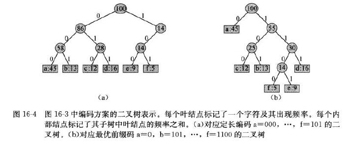
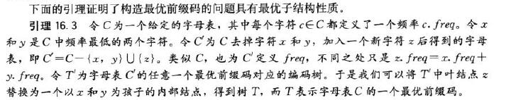

# 16.3 Huffman codes

标签： 贪心算法 哈夫曼编码

---
###笔记
**变长编码(variable-length code)**：赋予高频字符短码字，低频字符长码字，可以达到比定长编码好的多的压缩率。  
**前缀码(prefix code)**：即没有任何码子是其他码字的前缀。可以简化解码过程，由于没有码字是其他码字的前缀，编码文件的开始码字是无歧义的。

解码过程需要前缀码的一种方便的表示形式，以便我们可以容易地截取开始码字。可以用如图的二叉树，0意味着转向左孩子，1意味着转向右孩子，内部结点不包含字符关键字。



文件的最优编码方案对应一棵“满”二叉树（和通常意义的满二叉树不同），每个非叶结点都有两个孩子结点。

给定一棵对应前缀码的树T，根据下面公式可以很容的计算编码一个文件的二进制位。c.freq表示c在文件中的频率，d<sub>T</sub>(c)表示c的叶结点在树中的深度，也是c的码子的长度。我们定义B(T)为树T的代价。


**构造哈夫曼编码**  
假定C是n个字符的集合，每个字符c都是一个对象，属性c.freq给出了字符出现的频率。从|C|个叶结点开始，自底向上执行|C|-1此“合并”创建最终二叉树，过程中使用最小优先队列Q识别两个最低频率的对象进行合并，合并后两个对象得到的新对象的频率是原来两个对象频率之和。
```c++
Huffman(C)
    n = |C|
    Q = C
    for i = 1 to n-1
        allocate a new node z
        z.left = x = ExtractMin(Q)
        z.right = y = ExtractMin(Q)
        z.freq = x.freq + y.freq
        Insert(Q,z)
    return ExtractMin(Q)
```

**哈夫曼算法的正确性**  




```c++
//代码有点问题，遍历输出的时候程序会错误，没有找到原因。。
//下边代码可以正常访问，为什么有错还不清楚
#include <iostream>
#include <stdio.h>
#include <queue>
using namespace std;

struct TreeNode
{
    int freq;
    char c;
    TreeNode* left;
    TreeNode* right;
    TreeNode()
    {
        freq = 0;
        left = NULL;
        right = NULL;
    };
    TreeNode(int f, char cc)
    {
        freq = f;
        c = cc;
        left = NULL;
        right = NULL;
    }

    friend bool operator< (TreeNode n1, TreeNode n2)
    {
        return n1.freq > n2.freq;
    }
};

TreeNode Huffman(priority_queue<TreeNode> &q)
{
    int n = q.size();
    for (int i = 1; i <= n-1; i++)
    {
        TreeNode z = TreeNode();
        TreeNode x = TreeNode();
        TreeNode y = TreeNode();
        x = q.top();
        cout << "x:" << x.c << " " << x.freq << endl;
        z.left = &x;
        q.pop();
        y = q.top();
        cout << "y:" << y.c << " " << y.freq << endl;
        z.right = &y;
        q.pop();
        z.freq = z.left->freq + z.right->freq;
        q.push(z);
    }
    return q.top();
}

void PreOrder(TreeNode *root)
{
    if (root == NULL)
        return;
    cout << root->freq << " ";
    PreOrder(root->left);
    PreOrder(root->right);
}

int main()
{
//    freopen("out.txt", "w", stdout);
    priority_queue<TreeNode> q;
    int p[] = {45,5,9,12,13,16};
    char s[] = {'a','f','e','c','b','d'};
    int n = 6;
    for (int i = 0; i < n; i++)
        q.push(TreeNode(p[i], s[i]));

    TreeNode t = Huffman(q);
    TreeNode* root = &t;
    cout << root->left->freq << endl;
    PreOrder(root);
}
```

```c++
//这个代码可以正常访问
//栈或队列中要保存对象的指针
#include <iostream>
#include <stdio.h>
#include <stdlib.h>
#include <queue>
using namespace std;

struct TreeNode
{
    int freq;
    char c;
    TreeNode* left;
    TreeNode* right;
    TreeNode()
    {
        freq = 0;
        left = NULL;
        right = NULL;
    };
    TreeNode(int f, char cc)
    {
        freq = f;
        c = cc;
        left = NULL;
        right = NULL;
    }

    friend bool operator< (TreeNode n1, TreeNode n2)
    {
        return n1.freq > n2.freq;
    }
};

TreeNode* Huffman(priority_queue<TreeNode*> &q)
{
    int n = q.size();
    for (int i = 1; i <= n-1; i++)
    {
        TreeNode *z = (TreeNode*)malloc(sizeof(TreeNode));
        TreeNode *x = q.top();
        q.pop();
        TreeNode *y = q.top();
        q.pop();
        z->left = x;
        z->right = y;
        z->freq = z->left->freq + z->right->freq;
        q.push(z);
    }
    return q.top();
}

void PreOrder(TreeNode *root)
{
    if (root == NULL)
        return;
    cout << root->freq << " ";
    PreOrder(root->left);
    PreOrder(root->right);
}

int main()
{
//    freopen("out.txt", "w", stdout);
    priority_queue<TreeNode*> q;
    int p[] = {45,5,9,12,13,16};
    char s[] = {'a','f','e','c','b','d'};
    const int n = 6;
    TreeNode node[n];

    for (int i = 0; i < n; i++)
    {
        node[i].c = s[i];
        node[i].freq = p[i];
        q.push(&node[i]);
//不能用这个，临时变量可能用完就消亡了，再用指针会空指针
//      q.push(&TreeNode(p[i], s[i]));
    }

    TreeNode *root = Huffman(q);
    PreOrder(root);
}

```
