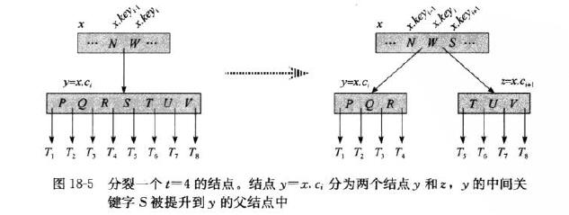
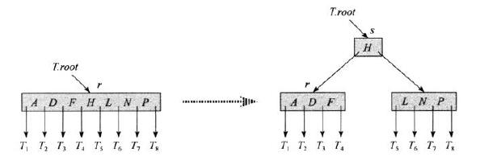
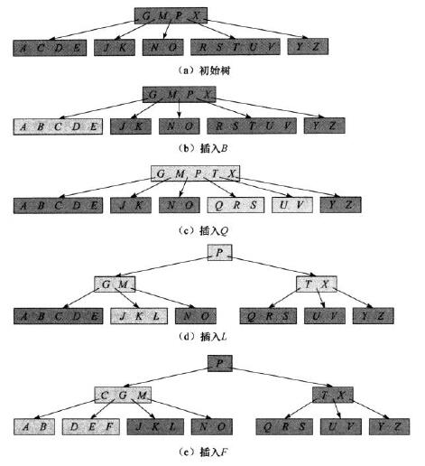

# 18.2 Basic operations on B-trees

标签： B树上基本操作 

---
###笔记
本节给出B树的查找、创建、插入的具体细节，在这个过程中，我们采用两种约定：  
1. B树根结点始终在主存中，所以无需对根结点做DISK-READ操作；但是当根结点被改变后，需要对根结点进行一次DISK-WRITE操作。
2. 任何被当成参数的结点在被传递之前，都要对他们进行一次DiskRead操作。

**搜索B树**  
搜索B树和搜索BST相似，区别在于对每个结点做的不是二叉分支选择，而是一个(x.n+1)路的分支选择。
```c++
//B树搜索伪代码
//输入为指向某子树根结点的指针，以及在子树上搜索的关键字k
//顶层调用为BTreeSearch(T.root, k)
//返回的是结点y和使得y.keyi = k的下标i的有序对(y,i)
BTreeSearch(x,k)
    i = 1
    while i <= x.n and k > x.key[i]
        i = i+1
    if i <= x.n and k == x.key[i]
        return (x,i)
    else if x.leaf  //x.leaf是bool值，如果x是叶结点
        return NIL
    else 
        DiskRead(x.c[i])    //k < x.key[i]，进入第i个子树
        return BTreeSearch(x.c[i],k)
```

> 和二叉搜索树一样，递归过程中所遇到的结点构成了一条从树根向下的简单路径，过程访问的磁盘页面数是O(h)=O(lg<sub>t</sub>n)，2-3行的while循环在每个结点所花费的时间是O(t)，总的cpu时间是O(th) = O(tlg<sub>t</sub>n)。

**创建一棵空的B树**
构造B树和构造二叉搜索树类似，但要先用BTreeCreate创建一个空的根结点，然后用BTreeInsert来添加新的关键字。这些过程用到一个辅助过程AllocateNode，它在O(1)时间内为一个结点分配磁盘页。假定由这个过程创建的结点并不需要DiskRead，因为磁盘上还没有关于这个结点的有用信息。
```c++
//创建根结点伪代码
BTreeCreate(T)
    x = AllocateNode
    x.leaf = TRUE
    x.n = 0
    DiskWrite(x)
    T.root = x
```

> BTreeCreate需要O(1)和O(1)的cpu时间。

**向B树中插入一个关键字**  
插入比二叉搜索树的插入要复杂，不能简单地创建一个新的叶子结点，因为这样得到的树可能不再是合法的B树。所以我们将新的关键字插入在一个已经存在的**叶结点**上。由于不能将关键字插入在一个满的叶结点，引入一个操作，**将一个满的结点y（有2t-1个关键字）按其中间关键字y.keyi分裂成两个各含有（t-1）个关键字的结点。中间关键字被提升到y的父节点。**如果y的父节点也是满的，就在插入之前将其分裂，最终满结点的分裂会沿着树向上传播。  
我们可以和二叉搜索树一样，在从树根到叶子结点这个单程向下的过程中将一个新的关键字插入B树中。**但是，我们并不是等到找出插入过程中实际要分裂的满结点时才分裂，当沿着树往下查找新关键字所属位置时，就分裂沿途遇到的每个满结点。因此每当要分裂结果满结点y时，就能确保它的父节点不是满的。**

**分裂B树的结点**  
过程BTreeSplitChild输入是一个非满的内部结点x（假设内存中）和一个在x中为满的孩子结点x.ci（假设也在内存中）的索引。如果要分裂一个满的根结点，我们首先应该让树根成为一个空结点的孩子，然后再用分裂过程，因此树高加1，**分裂是树高增加的唯一途径**。



```c++
BTreeSplitChild(x,i)
    z = AllocateNode()      //分配z空间，z来存储满结点x.c[i]的后半部分
    y = x.c[i]              //y指向那个满的结点
    z.leaf = y.leaf         //如果y是叶结点，z也标记成叶结点
    z.n = t-1
    for j = 1 to t-1        //把y的后半部分关键字给z        
        z.key[j] = y.key[j+t]
    if not y.leaf           //如果y不是叶结点，则有子树，把后半部分子树给z
        for j = 1 to t
            z.c[j] = y.c[j+t]
    y.n = t-1               //y的关键字设为n-1个
    for j = x.n+1 downto i+1//把x的子树后移一个位置
        x.c[j+1] = x.c[j]
    x.c[i+1] = z            //i+1棵子树指向z
    for j = x.n downto i    //x的关键字后移一个位置
        x.key[j+1] = x.key[j]
    x.key[i] = y.key[i]
    x.n = x.n+1             //x的关键字加1
    DiskWrite(y)
    DiskWrite(x)
    DiskWrite(x)
```

> 过程占用的cpu时间为θ(t)，整个过程执行了O(1)此磁盘操作。

**以沿树单程下行方式向B树插入关键字**  
在一棵高度为h的B树T中，沿树单程下行方式插入一个关键字k的操作需要O(h)此磁盘存取，所需要的CPU时间为O(th)=O(tlg<sub>t</sub>n)
```c++
BTreeInsert(T,k)                //k是关键字
    r = T.root
    if r.n == 2t-1              //处理根结点满了的情况
        s == AllocateNode()
        T.root = s
        s.leaf = FALSE
        s.n = 0
        s.c[1] = r
        BTreeSplitChild(s,1)
        BTreeInsertNonFull(s,k)
    else
        BTreeInsertNonFull(r,k)

```

> 上面if处理了根结点为满的情况，对根结点进行分裂是增加B树高度的唯一途径。**与二叉搜索树不同，B树高度的增加发生在顶部而不是底部。**




过程通过调用BTreeInsertNotFull完成将关键字k插入以非满的根结点为根的树中，此过程在需要时沿树向下递归，在必要时通过调用分裂过程保证任何时候它所递归处理的结点都是非满的。

BTreeInsertNonFull将关键字插入结点x，要求假定在调用该过程时候x是非满的，操作BTreeInesrt和BTreeInesrtNonFull保证这个假设成立。
```c++
BTreeInsertNonFull(x,k)
    i = x.n
    if x.leaf       //x是叶子结点
        while i >= 1 and k < x.key[i]   //边寻找插入位置边后移关键字
            x.key[i+1] = x.key[i]
            i = i-1
        x.key[i+1] = k
        x.n = x.n+1
        DiskWrite(x)
    else
        while i >= 1 and k < x.key[i]   //决定向x的那个结点递归下降
            i = i-1
        i = i+1
        DiskRead(x.c[i])
        if x.c[i].n == 2t-1             //检查是否递归下降至一个满结点上
            BTreeSplitChild(x,i)
            if k > x.key[i]             //根据定义，相等递归下降到两棵树的前一棵
                i = i+1
        BTreeInsertNonFull(x.x[i],k)
```

> 注意没有子树才是叶结点，所以x插入关键字如果子树为空也是叶结点。注意B树高度的增加发生在顶部不是底部。

对一棵高度为h的B树来说，BTreeInesrt需要做O(h)此存取，因为在每次调用BTreeInsertNonFull之间，只做了一次DiskRead和DiskWrite操作。因为因为在每次调用BTreeInsertNonFull之间是**尾递归**的，所以它也可以用一个while循环来实现，从而说明在任何时刻，需要留在主存中的页面数为O(1)。



###练习
18.2-1：本上。注意B树高度的增加发生在顶部不是底部。  
18.2-3：沿着每个结点的第一棵子树递归下降，如果第一棵子树为空，则最小关键字为第一个结点。（2）假设要找结点x第i个关键字的前驱，则找x.c[i]的最大关键字。  


[1]: https://github.com/wj1066/pictures/blob/master/CLRS/18.2-1.jpg
[2]: https://github.com/wj1066/pictures/blob/master/CLRS/18.2-2.jpg
[3]: https://github.com/wj1066/pictures/blob/master/CLRS/18.2-3.jpg