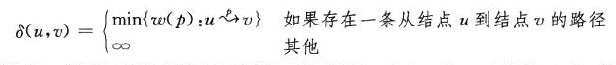
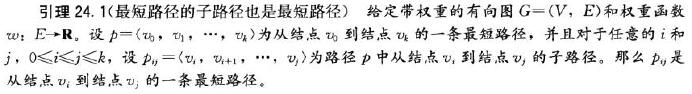
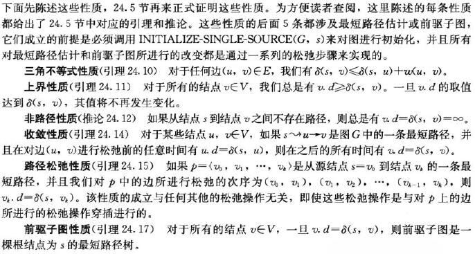

# 24.0 Single-Source Shortest Paths-Introduction

标签： 图 单源最短路径

---
###笔记
在**单源最短路径问题**中，我们给定一个带权重的有向图G={V,E}和权重函数`w:E->R`，该权重函数将每条边映射到实数值的权重上。一条路径的权重等于构成该路径的所有边的权重之和。

定义从结点u到结点v的最短路径权重δ(u,v)如下：



从u到v的最短路径则为**任何一条**权重为w(p) = δ(u,v)的从u到v的路径p。

在22.2节我们讨论的广度优先搜索算法就是一个求取最短路径的算法，但该算法只能用于**无权图**，即每条边的权重都是单位权重的图。

**最短路径的几个变体**  
**单目的地最短路径问题**：找到每个结点v到**目的地**结点t的最短路径。如果**将图的每条边的方向翻转过来**，就可以将这个问题转换为单源最短路径问题。  
**单结点对最短路径问题**：找到从定结点u到定结点v的最短路径。解决了额单源最短路径问题也就解决了这个问题。而且，**在该问题所有已知的算法中，最坏情况下的渐进运行时间都和最好的单源最短路径算法运行时间一样。  
**所有结点对的最短路径问题**：对于每个结点u到v，找到从结点u到结点v的最短路径，虽然可以通过针对每个结点运行一遍单源最短路径，但是也可以更快的解决这个问题，loyd等等。

**最优路径的最优子结构**  
算法以来最短路径的一个重要性质：两个结点之间的一条最短路径包含着其他的最短路径。Dijlstra算法就是一个贪心算法（首先具有了特征之一，最优子结构），Floyd-Warshell算法是一个贪心算法，该算法能够找出所有结点对之间的距离。

**引理24.1** 最短路径的子路径也是最短路径。



Dijkstra算法假定输入图的所有的边权中为非负值，Bellman-Ford算法允许图中包含负权重的边。

**环路**  
最短路径不能包含环路，无论权重为正负还是0。

**最短路径的表示**  
我们通常不仅希望计算出最短路径的权重，还希望计算出最短路径上的结点。对最短路径的表示和对广度优先搜索树的表示类似。给定图G=(V,E)，对每个结点v，我们维持一个**前驱结点v.π**，可能为另一个结点或者NIL。本章的最短路径将对每个结点的π进行设置，将从结点v开始的前驱结点链反过来就是从s到v的一条最短路径。

但是在运行最短路径的算法中，π值不一定能给出最短路径，如广度优先都说一样，**我们感兴趣的是π值所诱导的前驱子图G<sub>π</sub>=(V<sub>π</sub>,E<sub>π</sub>)**。这里我们定义


可以证明，本章的算法所生成的π具有如下性质：在算法终止的时候，G<sub>π</sub>是一棵**最短路径树**。最短路径树是一棵有根结点的树，该树包括了从源结点s到**每个**可以从s到达的结点的一条最短路径。**最短路径不一定是唯一的，最短路径树也不一定是唯一的**。

**松弛操作**  
本章算法需要**松弛(relaxation)**操作，对于每个结点v来说，维持一个属性v.d，来记录从源结点s到结点v的最短路径权重的上界，称v.d为s到v的**最短路径估计**

```c++
//我们用这个运行时间为θ(V)的算法来对最短路径估计和前驱结点进行初始化
InitializeSingleSource(G,s)
    for each vertex v ∈ G.V
        v.d = ∞
        v.d = NIL
    s.d = 0
```

**松弛过程**为：先测试下能否从s到v的最短路径进行改善。方法是，将从结点s到结点u之间的最短路径加上结点u到结点v的边权重，并与当前s到v的***最短路径估计**进行比较，如果前者更小，则对v.d和v.π进行更新。

```c++
//松弛操作
Relax(u,v,w)
    if v.d > u.d + w(u,v)
        v.d = u.d + w(u,v)
        v.π = u
```

本章的每个算法都将调用算法InitialSingleSource，然后重复对边进行松弛，而且**松弛是唯一导致最短路径和前驱结点发生变化的操作**。本章所讨论的所有算法之间的不同之处是对每条边进行松弛的次数和松弛边的次序不同。  
Dijkstra算法和用于有向无环的最短路径算法对每条边仅**松弛一次**。  
Bellman-Ford则对每条边**松弛|V-1|次**。

**最短路径和松弛操作的性质**  



本章所有的算法都假定有向图G是以邻接链表的形式存放的，此外变得权重和边本身是放在一起的，这样在遍历每条链表的时，可以在O(1)时间内获得边的权重。

[1]: https://github.com/wj1066/pictures/blob/master/CLRS/24.0-1.jpg
[2]: https://github.com/wj1066/pictures/blob/master/CLRS/24.0-2.jpg
[3]: https://github.com/wj1066/pictures/blob/master/CLRS/24.0-3.jpg
[4]: https://github.com/wj1066/pictures/blob/master/CLRS/24.0-4.jpg