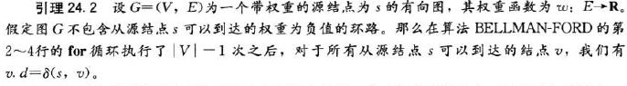
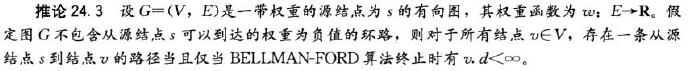
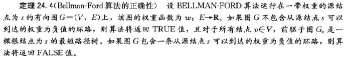

# 24.1 The Bellman-Ford algorithm

标签： 图 最短路径 Bellman-Ford

---
###笔记
Bellman-Ford算法解决的是一般情况下单源最短路径的问题，在这里**边的权值可以为负值**。

给定带权重的有向图G=(V,E)和权重函数w，Bellman-Ford算法返回一个布尔值来表明是否存在一个从源结点可以到达的权重为负值的环路，如果存在这样的环路，算法将告诉我们不存在解决方案，如果没有环路，算法就给出最短路径和他们的权值。

```c++
//伪代码
//Bellman-Ford算法
Bellman-Ford(G,w,s)
    InitialSingleSource(G,s)
    for i = 1 to |G.V|-1    //除源结点外V-1个结点，V-1次循环
        for each edge(u,v) ∈ G.E
            Relax(u,v,w)
    for each edge(u,v) ∈ G.E
        if v.d > u.d + w(u,v)
            return FALSE
    return TRUE
```

> 算法的时间复杂度是O(VE)。






