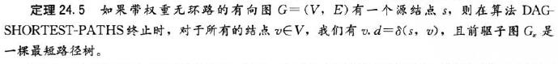

# 24.2 Single-source shortest paths in directed acyclic graphs

标签： 图 单源最短路径 有向无环图

---
###笔记
对于**有向无环图**来说的单源最短路径，又称**最小树形图**，我们**根据结点拓扑排序**对带权重的有向无环图进行边的松弛操作，就可以在θ(V+E)的时间内计算出从单个源结点到所有结点之间的最短路径。在有向无环图中，即使存在权值为负的边，但因为没有权重为负值的环路，最短路径也是存在的。

```c++
//θ(V+E)是建立在已经拓扑排序的情况下
DAGShortestPaths()
    topologically sort the vertices of G
    Initialize-Single-Source(G,s)
        for each vertex u, taken in topologically sorted order
            for each vertex v ∈ G.adj[u]
                Relax(u,v,w)
```



算法DAGShortestPath的一个应用是在Pert图中分析中进行关键路径的判断。
