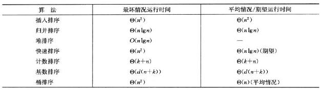

# 6.0 introduction

标签： 原址的 排序 性能

---
###前言
原址的：如果数组中仅有常数个元素需要在排序过程中存储在数组之外，则称排序算法是**原址的**。

所以，归并排序是非原址的，堆排序是原址的，快速排序也是原址的。

插入排序、归并排序、堆排序和快速排序都是**比较**类算法。

比较类算法可以通过**决策树模型**证明，任意比较排序算法排序n个元素的最坏情况运行时间的下界是Ω(nlogn)。如果通过比较操作之外的方法来获得输入序列的有序次序的信息，就有可能打破这个下界。

各种排序算法比较：

---
###

[1]: https://github.com/wj1066/pictures/blob/master/CLRS/6.0-1.jpg